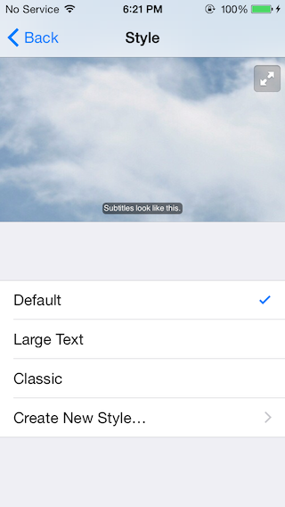
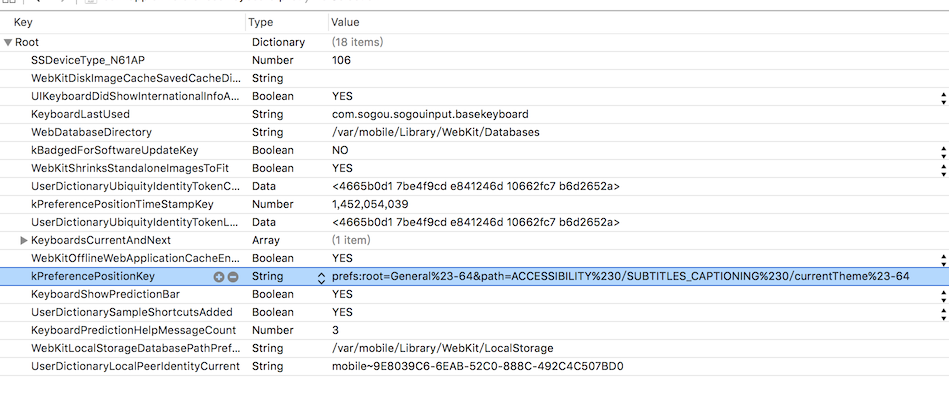

# iOS
The code for ios Dev.

## GetWiFiSSID.m
Get Wi-Fi Mac address and name.


## SBAppWindow Subview Tree
SpringBoard's all view.


## OpenPrefs
**Find The Settings path for openURL just like "prefs:root=General&path=About**

First of all, **Using a Jailbroken iOS device**, and you can read the file at "/private/var/mobile/Library/Preferences/com.apple.Preferences.plist"

 1. Launch system "Settings" navigate to item, and send the "Settings" to background.
 
Example:Settings -> General -> Accessibility -> Subtitles& Captioning -> Style
 

 
 2. Read the file by iFile installed by Cydia, or export by iFunbox for Mac.
 Path:`/private/var/mobile/Library/Preferences/com.apple.Preferences.plist`
 
 3. Read the 
 Key "kPreferencePositionKey"
 Value "prefs:root=General%23-64&path=ACCESSIBILITY%230/SUBTITLES_CAPTIONING%230/currentTheme%23-64"
  


 4. In you code add the openURL code below, and you can remove "%xxx".

 ```objc
   NSString *stringURL = @"prefs:root=General&path=ACCESSIBILITY%230/SUBTITLES_CAPTIONING%230/currentTheme%23-64";
   //NSString *stringURL = @"prefs:root=General&path=ACCESSIBILITY/SUBTITLES_CAPTIONING/currentTheme";
   [[UIApplication sharedApplication] openURL:[NSURL URLWithString:stringURL]];
 ```
